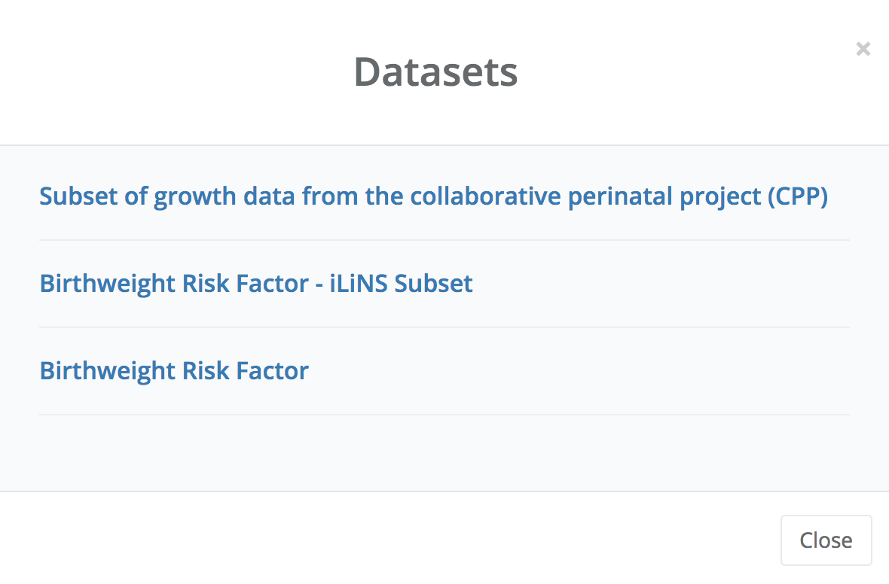
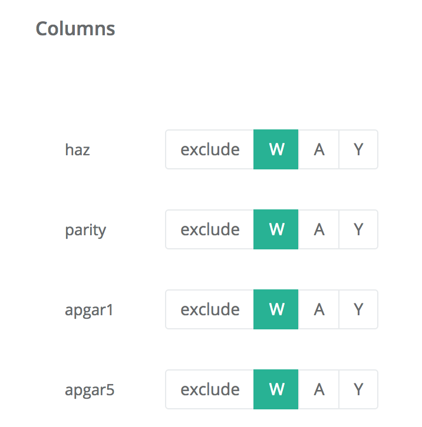
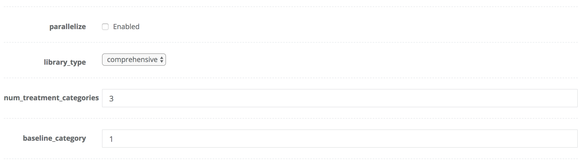

<!-- README.md is generated from README.Rmd. Please edit that file -->

```{r, echo = FALSE}
knitr::opts_chunk$set(
  collapse = TRUE,
  comment = "#>",
  fig.path = "README-"
)
```

# R/`longbowtools`: Longbow Interface in R

__Authors:__ [Jeremy Coyle](https://github.com/jeremyrcoyle)
---

# Introduction

Longbow is a templating framework that makes it easy to for both technical and nontechnical users to apply analysis methodologies implemented in R both locally and on remote compute clusters. The remote features are especially useful for data that must remain in place, for security and privacy reasons. 

Currently, the remote features implemented via the [Longbow web application](http://www.longbowapp.com) and its API have only been tested on the [GHAP.io](https://www.ghap.io) platform, and are limited to those users with access to [GHAP.io](https://www.ghap.io). There are planned extensions to these resources for other compute clusters. Until then, Longbow templates can still be applied locally by any user.

## Installation


Install the most recent _stable release_ from GitHub via
[`devtools`](https://www.rstudio.com/products/rpackages/devtools/):

```{r gh-master-installation, eval = FALSE}
devtools::install_github("tlverse/longbowtools")
```

---

# Longbow Templates

Longbow Templates are __parameterized__ R Markdown files. R Markdown allows a mix of R "chunks" and markdown formatted text. For an introduction to R Markdown, see [this guide](https://rmarkdown.rstudio.com/lesson-1.html) from RStudio. Longbow Templates take a set of parameters that specify a dataset to analyze, variable roles in that dataset, and end-user specifyable analysis options. This is a variation of general R Markdown parameterized reports as described [here](https://rmarkdown.rstudio.com/developer_parameterized_reports.html). The next section details the parameters common across Longbow Templates. 

After installing `longbowtools`, you can view an example template in R:

```{r view_example_template, eval = FALSE}
file.edit(system.file("examples", "example_template.Rmd", package="longbowtools"))
```

It's also [available on github](https://raw.githubusercontent.com/tlverse/longbowtools/master/inst/examples/example_template.Rmd). 

## Longbow Parameters

Longbow parameters and their default values are specified at the top of Longbow templates, in the YAML header. When running a template either locally or via Longbow API, these are supplied in a JSON file. After installing `longbowtools` a sample json file can be viewed via R:

```{r view_example_inputs, eval = FALSE}
file.edit(system.file("extdata", "sample_input.json", package="longbowtools"))
```

It's also [available on github](https://github.com/tlverse/longbowtools/blob/master/inst/extdata/sample_input.json). In the Longbow webapp, these parameters are rendered as web UI components that can accept user input. Each Longbow template has the following parameter sections:

### `data`

`data` specifies a dataset to apply the template to. Longbow accepts two main formats, a URI, and a file in a git repository (Longbow webapp only). In the webapp, this section is rendered as a drop-down list of datasets:



### `roles`

`roles` is a list of variable roles. Common roles include `W` (covariates), `A` (intervention node(s)), `Y` (outcomes), `id` (cluster or unit id for repeated measures data), `weights` (observation weights), `strata` (for stratified analyses), and `exclude` (for variables not to be used).

In the Longbow webapp, these are rendered as options in the variable role chooser:



### `nodes`

`nodes` specifies the role each variable plays in the dataset. Typically, these variables correspond to columns in the dataset specified by `data`. In the `inputs.json` file, this is a dictionary of lists, one for each `role` specified above.

### `script_params`

`script_params` is a set of user-specifiable options. In the Longbow webapp, these are rendered as UI components, similar to those described [here](https://rmarkdown.rstudio.com/developer_parameterized_reports.html). In the `inputs.json` file, this is a dictionary of options.



# Running Longbow Jobs

The easiest way to run Longbow templates is via the [Longbow web application](http://www.longbowapp.com). However, methods to run these templates in R have also been developed for ease of testing and programatic application of templates.

## Running Locally

For those without access to [GHAP.io](https://www.ghap.io), currently the only option is to run Longbow templates locally. To do so, simply provide a template file and an inputs json file to the `run_locally` function. The template will run, and the resulting output will open in a window.

```{r run_locally, eval = FALSE}
longbow_template <- system.file("examples", "example_template.Rmd", package="longbowtools")
inputs_file <- system.file("extdata", "sample_input.json", package="longbowtools")
run_locally(longbow_template, inputs_file)
```

Note that unlike Longbow via webapp or API, this currently does not take care to provision the correct set of packages and it does not to apply templates to data located in a git repository.

## Running via Longbow API

It is almost as easy to run jobs via the Longbow API. One simply needs to provide credentials to their cluster resources (currently [GHAP.io](https://www.ghap.io) only). These are stored in a json file with the following structure: . Username, password, and ip refer to your GHAP credentials. The Longbow token can be obtained here: https://www.longbowapp.com/token/. Pass this file to `configure_cluster` to specify the credentials, then run the job as before, except using `run_on_longbow`.

```{json example_credentials}
{"username": "username here", 
"password": "password here", 
"ip": "ip or hostname here",
"longbow_token": "longbow token here"}

```

```{r run_on_longbow, eval = FALSE}
configure_cluster("~/cluster_credentials.json")
run_on_longbow(longbow_template, inputs_file)
```


# Writing Longbow Templates

How-to vignette coming soon.

# Batch Processing

Batch processing features are currently in development. When complete, it will be possible to submit a "batch job" -- a collection of input json files to be run against a Longbow template. Users will then be able to collect and combine results from the batch.

---

## License

&copy; 2017 [Jeremy R. Coyle](https://github.com/jeremyrcoyle)
The contents of this repository are distributed under the GPL-3 license. See
file `LICENSE` for details.

